<!-- 2026 badge -->

<!-- Typing effect header -->

<!-- Profile views -->

---

### 👨‍💻 Tentang Saya

Saya **Asep Ready** — suka belajar hal baru, eksplorasi teknologi, dan membangun sesuatu yang berguna.

- 🔭 Saat ini fokus pada **development** & **system/DevOps**
- 🌱 Sedang mendalami **FreeBSD**, scripting, dan automation
- 💬 Tanya saya tentang **Linux/BSD**, **web dev**, atau **tooling**
- 📫 Hubungi: sesuaikan dengan email/LinkedIn kamu

---

### 🛠️ Tech & Tools

<!-- Badges - sesuaikan dengan skill kamu -->

---

### 📊 GitHub Stats

<!-- Card di-generate oleh GitHub Action (profile/stats.svg, profile/top-langs.svg) supaya icon tidak gagal load -->

  

<!-- Streak (Vercel/demolab - Heroku sering gagal load) -->

  

<!-- Trophy -->

  

---

### 📌 Featured & Learning

| Repo | Deskripsi |
|------|-----------|
| [belajar-freebsd](https://github.com/asepready/belajar-freebsd) | Catatan & materi belajar FreeBSD |

_Tambah repo andalan lain di tabel ini._

---

### 🤝 Connect With Me

<!-- Sesuaikan link dengan akun kamu -->

---

### 🐍 Contribution Graph (Snake)

> Snake ini di-generate otomatis dari contribution graph. Akan muncul setelah workflow pertama jalan (atau trigger manual di tab Actions).

<picture>
  <source media="(prefers-color-scheme: dark)" srcset="https://raw.githubusercontent.com/asepready/asepready/output/github-contribution-grid-snake-dark.svg" />
  <source media="(prefers-color-scheme: light)" srcset="https://raw.githubusercontent.com/asepready/asepready/output/github-contribution-grid-snake.svg" />
  
</picture>

---

⭐ From asepready with care · 2026

