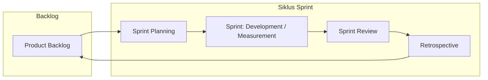

# Rancangan Agile/Scrum untuk Penelitian FreeBSD pada Orange Pi Zero LTS

Dokumen ini memetakan **penelitian FreeBSD 15 di Orange Pi Zero LTS** ke dalam kerangka Agile/Scrum agar pelaksanaan penelitian bersifat iteratif, terukur, dan terdokumentasi. Panduan teknis instalasi, build, dan optimalisasi ada di [FreeBSD-15-Orange-Pi-Zero-LTS.md](FreeBSD-15-Orange-Pi-Zero-LTS.md).

---

## 1. Konteks dan tujuan penelitian

**Ringkasan:** Penelitian berfokus pada FreeBSD 15 yang berjalan di papan **Orange Pi Zero LTS** (SoC Allwinner H3, 256/512 MB RAM, armv7). Tujuannya adalah mendokumentasikan perilaku sistem, mengukur kinerja dan batasan, serta menghasilkan rekomendasi penggunaan yang dapat diandalkan.

**Deliverable yang diharapkan:**

- **(a)** Panduan teruji dan terlengkap (melengkapi atau mereferensikan dokumen teknis yang ada).
- **(b)** Data pengukuran (boot time, penggunaan RAM/CPU, stabilitas) dalam bentuk tabel atau catatan.
- **(c)** Temuan batasan dan rekomendasi penggunaan (use case yang cocok/tidak, known issues).

---

## 2. Kerangka Agile/Scrum

| Unsur | Penjelasan |
|-------|------------|
| **Product** | Hasil penelitian: dokumentasi temuan, data pengukuran, rekomendasi. Dapat meng-update atau melengkapi dokumen teknis yang ada. |
| **Sprint** | Siklus 1–2 minggu. Jumlah sprint bebas (contoh: 4–6 sprint). |
| **Tim** | Dapat solo; peran Product Owner / Scrum Master dapat digabung. |
| **Ceremony** | Sprint Planning, Daily (stand-up singkat), Sprint Review, Retrospective; Backlog Refinement opsional. |

---

## 3. Product backlog (Epic dan User Story)

### Epic 1 – Persiapan dan instalasi

| ID | User story | Kriteria penerimaan |
|----|------------|---------------------|
| E1.1 | Sebagai peneliti, saya ingin lingkungan (SD, image, U-Boot) siap dan instalasi FreeBSD berhasil di board agar bisa lanjut ke pengukuran. | Image tertulis ke SD; U-Boot terpasang; board boot; akses SSH berhasil. |
| E1.2 | Sebagai pembaca, saya ingin langkah instalasi yang berhasil terdokumentasi atau direferensikan. | Ada referensi ke panduan (mis. FreeBSD-15-Orange-Pi-Zero-LTS.md) atau catatan singkat langkah yang dipakai. |

### Epic 2 – Pengukuran dan observasi

| ID | User story | Kriteria penerimaan |
|----|------------|---------------------|
| E2.1 | Sebagai peneliti, saya ingin boot time tercatat agar punya baseline. | Boot time (dari power-on sampai layanan SSH/listen) tercatat (tabel atau catatan). |
| E2.2 | Sebagai peneliti, saya ingin penggunaan RAM dan CPU (idle dan under load) terdokumentasi. | Data RAM/CPU idle dan under load (satu skenario) tercatat. |
| E2.3 | Sebagai peneliti, saya ingin observasi stabilitas (uptime, crash) agar tahu batasan operasional. | Catatan uptime atau tes stabilitas singkat; jika ada crash/error, terdokumentasi. |

### Epic 3 – Konfigurasi dan optimalisasi

| ID | User story | Kriteria penerimaan |
|----|------------|---------------------|
| E3.1 | Sebagai peneliti, saya ingin tuning (rc.conf, sysctl, loader.conf, noatime) diterapkan dan dampaknya diukur. | Konfigurasi diterapkan; dampak (RAM/kinerja) dicatat atau dibandingkan. |
| E3.2 | Sebagai pembaca, saya ingin konfigurasi final dan peringatan (mis. parameter read-only) terdokumentasi. | Konfigurasi yang berhasil + peringatan (mis. sysctl vs loader.conf) tertulis di doc atau catatan. |

### Epic 4 – Layanan dan penggunaan

| ID | User story | Kriteria penerimaan |
|----|------------|---------------------|
| E4.1 | Sebagai peneliti, saya ingin satu layanan contoh (SSH, metrics exporter, cron job, atau **API minimal**) berjalan dan batasan resource didokumentasikan. | Layanan berjalan; cara deploy dan batasan resource (RAM/CPU) tercatat. |

**Contoh layanan: API `/my-api`** — Sebagai skenario konkret untuk Sprint 4, layanan contoh dapat berupa HTTP API minimal yang melayani **GET /my-api** (mis. mengembalikan JSON berisi status, uptime, atau info board). Implementasi contoh (Rust, tanpa dependency) ada di **[examples/my-api](../examples/my-api/)**. Dokumentasi teknis dan endpoint: [FreeBSD-15-Orange-Pi-Zero-LTS.md](FreeBSD-15-Orange-Pi-Zero-LTS.md#contoh-layanan-my-api).

### Epic 5 – Sintesis dan rekomendasi

| ID | User story | Kriteria penerimaan |
|----|------------|---------------------|
| E5.1 | Sebagai pembaca, saya ingin temuan dirangkum dan rekomendasi penggunaan (cocok/tidak cocok) tertulis. | Ada ringkasan temuan dan rekomendasi use case. |
| E5.2 | Sebagai pembaca, saya ingin daftar known issues dan referensi tersedia. | Daftar known issues + link/referensi (Handbook, Wiki) tertulis. |

---

## 4. Sprint (contoh 4–6 sprint)

| Sprint | Goal | Backlog (Epic / US) |
|--------|------|----------------------|
| **Sprint 1** | FreeBSD jalan di board, akses SSH. | Epic 1 (E1.1, E1.2). |
| **Sprint 2** | Data boot time, RAM, CPU terdokumentasi. | Epic 2 (E2.1, E2.2, E2.3). |
| **Sprint 3** | Konfigurasi optimal terdokumentasi beserta peringatan. | Epic 3 (E3.1, E3.2). |
| **Sprint 4** | Satu skenario penggunaan (layanan contoh, e.g. API **/my-api**) terdokumentasi. | Epic 4 (E4.1). |
| **Sprint 5–6** | Rekomendasi dan known issues tertulis. | Epic 5 (E5.1, E5.2). |

Setiap sprint memiliki **Sprint Goal** satu kalimat (kolom Goal) dan daftar User Story yang dipilih (kolom Backlog). Di Sprint Planning, task dapat di-breakdown lebih rinci (mis. "Siapkan SD", "Tulis image", "Pasang U-Boot", "Tes boot").

---

## 5. Definition of Done (DoD) penelitian

Suatu User Story penelitian dianggap **Done** jika:

1. **Tugas lapangan/simulasi selesai** — aktivitas (instalasi, pengukuran, konfigurasi, deploy layanan) telah dilakukan.
2. **Hasil tercatat di repo** — langkah, angka, konfigurasi, atau temuan tertulis di dokumen atau file data dalam repo.
3. **Dapat ditunjukkan di Sprint Review** — hasil bisa didemonstrasikan atau dijelaskan (demo, tabel, cuplikan doc).

Dokumen rancangan ini (Agile-Scrum-Penelitian-FreeBSD-Orange-Pi-Zero-LTS.md) tidak wajib di-update setiap sprint; yang di-update adalah **artefak penelitian** (catatan, tabel, atau bagian di dokumen teknis).

---

## 6. Alur Scrum (diagram)

Fase penelitian (konseptual) sejalan dengan Epic:

---

## 7. Referensi

- **Panduan teknis:** [FreeBSD-15-Orange-Pi-Zero-LTS.md](FreeBSD-15-Orange-Pi-Zero-LTS.md) — instalasi, build, optimalisasi, Rust, rancangan custom build.
- **Pengamanan FreeBSD:** [FreeBSD-Hardening-OpenBSD-Style.md](FreeBSD-Hardening-OpenBSD-Style.md) — firewall, SSH, sysctl, update, jails, checklist keamanan.
- **FreeBSD:** [FreeBSD Documentation Portal](https://docs.freebsd.org/en/), [FreeBSD Handbook](https://docs.freebsd.org/en/books/handbook/).
- **Hardware / ARM:** [FreeBSD Wiki – Allwinner / H3](https://wiki.freebsd.org/arm/Allwinner/H3).
