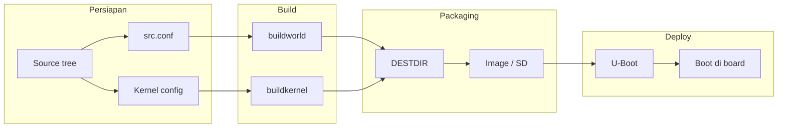

# Panduan Install / Build FreeBSD 15 untuk Orange Pi Zero LTS

**Orange Pi Zero LTS** memakai SoC **Allwinner H3** (Quad Cortex-A7, 32-bit). FreeBSD mendukung H3; board **Orange Pi Zero** tercantum di wiki resmi. Tidak ada image khusus "Orange Pi Zero LTS"—yang dipakai adalah image **armv7 GENERICSD** plus **U-Boot Orange Pi Zero**.

---

## Kecocokan hardware (Orange Pi Zero LTS vs FreeBSD H3)

Pemetaan antara hardware Orange Pi Zero LTS dan dukungan FreeBSD untuk SoC Allwinner H3 (sumber: [FreeBSD Wiki – Allwinner](https://wiki.freebsd.org/arm/Allwinner)).

| Komponen Orange Pi Zero LTS | Spesifikasi board | Dukungan FreeBSD H3 | Keterangan |
|-----------------------------|-------------------|---------------------|------------|
| **CPU** | H3 Quad-core Cortex-A7 | Didukung (armv7) | Kernel GENERIC armv7 |
| **Ethernet** | 10/100M RJ45 | **YES** | Cocok untuk SSH dan layanan jaringan |
| **TF card (SD/MMC)** | Max. 32 GB | **YES** | Boot dan root filesystem dari SD |
| **USB 2.0 / USB OTG** | Power + data | **YES** (USB Host, USB DRD) | Power lewat OTG; host untuk perangkat USB |
| **Wi-Fi** | XR819, 802.11 b/g/n | **Tidak didukung** | SDIO WiFi belum didukung di FreeBSD Allwinner; gunakan Ethernet |
| **GPIO** | 26-pin + 13-pin header | **YES** | |
| **UART** | Serial console | **YES** | Berguna untuk debug tanpa jaringan |
| **I2C** | Via header | **YES** | |
| **SPI** | 2 MB onboard SPI Flash | **YES** | |
| **Thermal** | Sensor suhu SoC | **YES** | cpufreq/DVFS didukung |
| **Watchdog** | | **YES** | |
| **Audio (MIC/AV)** | Via papan 13-pin | Belum/tidak umum | Bukan prioritas di wiki |
| **HDMI / Display** | Tidak ada di Zero LTS | - | Board tanpa HDMI; akses via SSH/serial |

**Yang belum didukung FreeBSD (umum untuk board Allwinner):**

- **SDIO WiFi** (termasuk XR819) — gunakan Ethernet.
- Bluetooth UART (ng_h4).
- Beberapa fitur SoC: Display Engine 2.0, I2S/TDM, NAND, crypto engine, dll.

**Ringkasan:** Untuk Orange Pi Zero LTS di FreeBSD 15, **Ethernet, SD, USB, UART, GPIO, I2C, SPI** cocok dan didukung; **Wi-Fi onboard tidak**. Akses utama: **SSH via Ethernet** atau **serial console**.

---

## Opsi A: Install dari image resmi (paling sederhana)

Cara ini disarankan jika Anda tidak perlu build dari source.

### 1. Yang dibutuhkan

- PC dengan FreeBSD atau Linux (untuk menulis ke microSD).
- MicroSD minimal **8 GB** (disarankan 16 GB).
- Orange Pi Zero LTS, kabel Ethernet, power USB.

### 2. Unduh image FreeBSD 15 armv7 (GENERICSD)

- **Release 15.0** (armv7):
  - [FreeBSD release mirror](https://download.freebsd.org/ftp/releases/arm/armv7/15.0-RELEASE/) — cari file:
    - `FreeBSD-15.0-RELEASE-arm-armv7-GENERICSD.img.xz`
  - Atau mirror lain, misalnya:
    - [ftp.halifax.rwth-aachen.de](https://ftp.halifax.rwth-aachen.de/pub/FreeBSD/releases/arm/armv7/15.0-RELEASE/)
- **Snapshot** (jika ingin versi terbaru):
  - [download.freebsd.org/snapshots/arm/armv7](https://download.freebsd.org/snapshots/arm/armv7/) — cari direktori ISO-IMAGES/15.0 dan file `*GENERICSD*.img.xz`.

Verifikasi dengan file checksum (SHA256/SHA512) yang ada di folder yang sama.

### 3. Tulis image ke microSD

Ganti `sdX` (Linux) atau `da0` (FreeBSD) dengan device microSD Anda.

**Di Linux:**

```bash
xz -d -c FreeBSD-15.0-RELEASE-arm-armv7-GENERICSD.img.xz | sudo dd of=/dev/sdX bs=1M status=progress conv=fsync
```

**Di FreeBSD:**

```bash
xz -d -c FreeBSD-15.0-RELEASE-arm-armv7-GENERICSD.img.xz | sudo dd of=/dev/da0 bs=1m status=progress conv=fsync
```

### 4. Pasang U-Boot untuk Orange Pi Zero

Tanpa U-Boot yang benar, board tidak akan boot. FreeBSD menyediakan port **`u-boot-orangepi-zero`** (untuk H3, cocok untuk Zero LTS).

**Di mesin FreeBSD** (setelah image sudah di SD):

```bash
# Install port/package u-boot Orange Pi Zero
pkg install u-boot-orangepi-zero
# Atau dari ports:
# cd /usr/ports/sysutils/u-boot-orangepi-zero && make install clean
```

Lalu tulis U-Boot ke **microSD yang sudah berisi image** (device yang sama seperti di atas).

**Untuk SoC 32-bit (H3):**

```bash
# Ganti /dev/da0 dengan device SD Anda
sudo dd if=/usr/local/share/u-boot/u-boot-orangepi-zero/u-boot-sunxi-with-spl.bin conv=notrunc,sync of=/dev/da0 bs=1k seek=8
```

Sumber: [FreeBSD Wiki – Allwinner booting](https://wiki.freebsd.org/arm/Allwinner/booting).

### 5. Boot

- Masukkan microSD ke Orange Pi Zero LTS.
- Hubungkan Ethernet (disarankan untuk akses SSH).
- Nyalakan lewat USB OTG.
- Tanpa HDMI, akses lewat **SSH**. Cek alamat IP di router/DHCP atau pasang serial console jika ada.
- Login: `root` (password kosong atau sesuai yang di-set di image—ubah setelah pertama kali login).

---

## Opsi B: Build dari source (FreeBSD 15)

Jika Anda ingin build sendiri (misalnya dengan patch atau kernel custom).

### 1. Mesin build

- FreeBSD 15 (atau 14) amd64 di PC.
- Cukup ruang disk dan RAM; toolchain default FreeBSD (cross-build armv7) atau mesin ARM untuk native build.

### 2. Source dan build

```bash
# Clone source (contoh untuk 15.0-RELEASE atau releng/15.0)
git clone https://git.freebsd.org/src.git /usr/src
cd /usr/src
git checkout release/15.0.0   # atau branch yang Anda mau

# Build world + kernel untuk armv7 (H3 adalah 32-bit)
make -j$(sysctl -n hw.ncpu) TARGET_ARCH=armv7 buildworld
make -j$(sysctl -n hw.ncpu) TARGET_ARCH=armv7 buildkernel KERNCONF=GENERIC

# Buat direktori root (misalnya untuk NFS atau image)
export DESTDIR=/path/to/rootfs
make TARGET_ARCH=armv7 installworld DESTDIR=$DESTDIR
make TARGET_ARCH=armv7 distribution DESTDIR=$DESTDIR
make TARGET_ARCH=armv7 installkernel KERNCONF=GENERIC DESTDIR=$DESTDIR
```

Untuk **image SD** (bukan NFS), Anda bisa memakai script release FreeBSD ([release/arm](https://svnweb.freebsd.org/base/head/release/arm/)), atau membuat partisi FAT + UFS di SD, mengopi hasil `installworld` + `installkernel` ke partisi UFS, dan mengopi `loader.efi` (dari `boot/`) ke partisi FAT di `EFI/boot/bootarm.efi`, plus tetap menulis U-Boot seperti di Opsi A.

### 3. Device tree (DTB) H3 / Orange Pi Zero

Kernel GENERIC untuk armv7 biasanya sudah membawa DTB untuk Allwinner H3. Board yang didukung resmi termasuk **Orange Pi Zero** ([FreeBSD Wiki – H3](https://wiki.freebsd.org/arm/Allwinner/H3)). Orange Pi Zero LTS juga memakai H3, sehingga DTB yang sama umumnya dipakai. Jika ada masalah (misalnya ethernet tidak kena), Anda bisa mengecek DTB di `sys/modules/dtb/allwinner/` di source dan menambah/memodifikasi DTB lewat dokumentasi wiki jika diperlukan.

### 4. U-Boot

Tetap pakai **`u-boot-orangepi-zero`** seperti di Opsi A; tidak perlu build U-Boot manual kecuali Anda ingin konfigurasi khusus.

---

## Rancangan build custom FreeBSD (optimal Orange Pi Zero LTS)

Bagian ini menguraikan **rancangan (design)** untuk membangun FreeBSD versi kustom yang dioptimalkan untuk Orange Pi Zero LTS: kernel yang dipangkas (hanya device/fitur yang dipakai di H3), world minimal (tanpa X, dokumentasi berat, dll.), dan alur dari source sampai image SD yang siap boot.

**Tujuan:** Ukuran image dan pemakaian RAM lebih kecil; target **armv7**, board **Orange Pi Zero LTS** (Allwinner H3).

### Alur build (ringkas)



### 1. Mesin build

- **OS:** FreeBSD 14 atau 15 amd64 (PC atau VM).
- **Resource:** Disk ~20–50 GB, RAM 4 GB+.
- **Paket:** `pkg install git gmake`.
- **Source:** Clone ke `/usr/src`, branch `release/15.0.0` atau `releng/15.0` (lihat [Opsi B](#opsi-b-build-dari-source-freebsd-15)).

### 2. Kernel kustom (KERNCONF)

Buat file konfigurasi kernel baru di `sys/arm/conf/` (mis. **ORANGEPIZERO**) berdasarkan GENERIC:

- **Pertahankan:** FDT/DTB Allwinner H3, MMC/SD, Ethernet, USB, UART, GPIO, GEOM_PART.
- **Buang/nonaktifkan:** device atau option yang tidak ada di H3 (mis. PCI tertentu, GPU berat).

Contoh lokasi dan perintah:

```bash
cd /usr/src/sys/arm/conf
cp GENERIC ORANGEPIZERO
# Edit ORANGEPIZERO: sesuaikan ident, fdt (sun8i-h3-orangepi-zero.dts), dan device list
```

Build kernel:

```bash
cd /usr/src
make buildkernel KERNCONF=ORANGEPIZERO TARGET_ARCH=armv7
```

Referensi: [config(5)](https://man.freebsd.org/cgi/man.cgi?query=config).

### 3. World minimal (src.conf)

Buat file **src.conf** (atau set `SRCCONF`) agar base system lebih kecil. Contoh:

```makefile
# Contoh untuk board headless
WITHOUT_X11=yes
WITHOUT_LLVM=yes
WITHOUT_LLD=yes
WITHOUT_CLANG=yes
WITHOUT_GAMES=yes
WITHOUT_MAN=yes
WITHOUT_INFO=yes
WITHOUT_EXAMPLES=yes
```

Build world:

```bash
cd /usr/src
make buildworld TARGET_ARCH=armv7
```

### 4. DTB (Device Tree)

Pastikan DTB untuk Orange Pi Zero (H3) ikut ter-install. Nama DTB di kernel config (mis. `sun8i-h3-orangepi-zero.dts`) harus sesuai; `make installkernel` akan mengopi DTB ke `DESTDIR/boot/dtb/`. Lihat juga [Device tree (DTB) H3 / Orange Pi Zero](#3-device-tree-dtb-h3--orange-pi-zero) di Opsi B.

### 5. Install ke DESTDIR

```bash
export DESTDIR=/tmp/opiroot
mkdir -p $DESTDIR
make installworld TARGET_ARCH=armv7 DESTDIR=$DESTDIR
make distribution TARGET_ARCH=armv7 DESTDIR=$DESTDIR
make installkernel KERNCONF=ORANGEPIZERO TARGET_ARCH=armv7 DESTDIR=$DESTDIR
```

Isi `$DESTDIR` dipakai sebagai root filesystem untuk partisi UFS di SD atau untuk membuat image.

### 6. Image / partisi SD

Dua pendekatan:

- **Opsi (a):** Buat image file (layout partisi + UFS + boot), lalu tulis ke SD dengan `dd`.
- **Opsi (b):** Siapkan SD langsung: `gpart` (MBR), partisi FAT (untuk loader) + UFS (root), `newfs` pada partisi UFS, mount, copy isi `$DESTDIR` ke partisi root, dan salin loader ke partisi FAT (`EFI/boot/bootarm.efi`).

Tetap diperlukan: partisi FAT untuk loader dan U-Boot di sector awal (layout seperti di [Allwinner booting](https://wiki.freebsd.org/arm/Allwinner/booting)).

### 7. U-Boot

Tidak di-build dalam rancangan ini. Pakai **u-boot-orangepi-zero** dari port/paket seperti di [Opsi A](#opsi-a-install-dari-image-resmi-paling-sederhana); tulis ke SD dengan:

```bash
dd if=/usr/local/share/u-boot/u-boot-orangepi-zero/u-boot-sunxi-with-spl.bin conv=notrunc,sync of=/dev/da0 bs=1k seek=8
```

### Ringkasan langkah

1. Clone/checkout source FreeBSD 15 (arm).
2. Buat KERNCONF (mis. ORANGEPIZERO) dan src.conf.
3. `make buildworld` dan `make buildkernel KERNCONF=ORANGEPIZERO` untuk `TARGET_ARCH=armv7`.
4. `installworld`, `distribution`, `installkernel` ke DESTDIR.
5. Siapkan image atau partisi SD; isi root dari DESTDIR dan atur loader di partisi FAT.
6. Tulis U-Boot ke SD (`dd ... bs=1k seek=8`).
7. Boot Orange Pi Zero LTS dari SD.

### Referensi rancangan

- [FreeBSD Handbook – Building from source](https://docs.freebsd.org/en/books/handbook/cutting-edge/).
- [FreeBSD Wiki – Allwinner / H3](https://wiki.freebsd.org/arm/Allwinner/H3).
- Script release ARM: `src/release/arm` di source tree.
- U-Boot dan layout SD: [Allwinner booting](https://wiki.freebsd.org/arm/Allwinner/booting); instalasi image dan U-Boot di dokumen ini (Opsi A, Opsi B).

---

## Optimalisasi FreeBSD 15 di board (Orange Pi Zero LTS)

Setelah instalasi, konfigurasi berikut membantu FreeBSD 15 berjalan optimal di Orange Pi Zero LTS (RAM 256/512 MB, penyimpanan SD).

### 1. Layanan minimal di `/etc/rc.conf`

Hanya nyalakan layanan yang dipakai agar menghemat RAM dan CPU:

```bash
# Jaringan (wajib jika pakai DHCP)
ifconfig_DEFAULT="DHCP"

# SSH untuk akses remote
sshd_enable="YES"

# Waktu (penting untuk log dan TLS)
ntpdate_enable="YES"
ntpd_enable="YES"

# Opsional: matikan jika tidak dipakai
sendmail_enable="NONE"
sendmail_submit_enable="NO"
sendmail_outbound_enable="NO"
sendmail_msp_queue_enable="NO"

# Bersihkan /tmp saat boot (hemat ruang)
clear_tmp_enable="YES"

# Cron hanya jika perlu jadwal
# cron_enable="YES"
```

### 2. Tuning kernel dan memori (`sysctl`) — opsional

Buat file `/etc/sysctl.conf` (atau tambahkan ke file yang sudah ada) untuk membatasi pemakaian memori dan cocok untuk RAM kecil. Reboot atau jalankan `sysctl -f /etc/sysctl.conf` setelah mengubah.

```bash
# Kurangi tekanan pada memori (sesuai 256/512 MB)
kern.maxvnodes=12000
vfs.vmiodirenable=1

# Jaringan: buffer konservatif
kern.ipc.nmbclusters=2048
kern.ipc.nmbjumbop=0
net.inet.tcp.syncache.hashsize=256
net.inet.tcp.syncache.bucketlimit=30
```

Nilai bisa disesuaikan; jika layanan ringan saja, default sering sudah cukup.

### 3. Mount options untuk SD card (kurangi tulis, perpanjang umur SD)

Di `/etc/fstab`, tambahkan opsi **noatime** untuk partisi root (dan partisi lain di SD) agar tidak menulis akses time pada setiap baca:

```text
# Contoh baris root (sesuaikan device dan fs)
/dev/mmcsd0s2a  /  ufs  rw,noatime  1  1
```

Ganti `mmcsd0s2a` dengan device root Anda (cek dengan `mount`). Setelah diedit, reboot atau remount: `mount -u /`.

### 4. Manajemen daya dan thermal (H3 mendukung cpufreq)

FreeBSD H3 mendukung cpufreq/DVFS. Untuk membatasi panas dan konsumsi daya (berguna di enclosure kecil):

```bash
# Aktifkan powerd (atur frekuensi CPU dinamis)
powerd_enable="YES"
powerd_flags="-a hiadaptive -b adaptive"
```

Atau tetap frekuensi tetap rendah jika ingin lebih dingin/hemat daya (nilai tergantung SoC, cek `sysctl dev.cpu`).

### 5. Paket: instal hanya yang diperlukan

Hindari instal banyak port/paket sekaligus. Untuk headless server:

```bash
pkg install bash  # opsional, jika suka bash
# Hindari desktop, browser, atau tool berat
```

### 6. Ringkasan checklist optimal

| Aspek | Tindakan |
|-------|----------|
| Layanan | Hanya `sshd`, DHCP/ntp; matikan sendmail jika tidak dipakai |
| Memori | Pertimbangkan `kern.maxvnodes` dan opsi sysctl lain jika RAM 256 MB |
| SD card | Pakai `noatime` di fstab untuk partisi di SD |
| CPU/thermal | Aktifkan `powerd` untuk scaling frekuensi |
| Paket | Minimal: hanya yang dipakai untuk peran board (router, NAS, dll.) |

Dengan ini FreeBSD 15 di board bisa diarahkan untuk peran seperti router kecil, gateway, atau server layanan ringan dengan sumber daya terbatas.

---

## Setup Rust

Rust cocok untuk Orange Pi Zero LTS: binary standalone, tidak butuh runtime di board, dan pemakaian memori saat jalan umumnya kecil. Ada dua pendekatan: (1) instal Rust langsung di board, atau (2) **cross-compile di PC lalu deploy binary ke board** (disarankan untuk hemat RAM 256/512 MB).

### Opsi 1: Rust di board (langsung di Orange Pi)

Jika Anda ingin compile di board itu sendiri:

```bash
# Install Rust lewat paket FreeBSD
pkg install rust
# Cek: cargo --version
```

Target native: host sudah armv7-freebsd, cukup jalankan:

```bash
cargo build --release
```

Anda juga bisa memakai [rustup](https://rustup.rs) jika tersedia untuk FreeBSD armv7 (cek platform support di situs rustup). **Peringatan:** compile di board memakan banyak RAM dan waktu; untuk RAM 256 MB lebih aman memakai cross-compile (Opsi 2).

### Opsi 2: Cross-compile dari PC (disarankan)

Develop di mesin PC (FreeBSD amd64, Linux, atau Windows), build untuk target armv7-freebsd, lalu copy binary ke board.

1. **Instal Rust di PC** (misalnya lewat [rustup](https://rustup.rs)).  
2. **Tambah target** untuk FreeBSD armv7 (jika tersedia di rustup):
   ```bash
   rustup target add armv7-unknown-freebsd
   ```
   Jika target belum ada, mungkin perlu [custom target](https://doc.rust-lang.org/rustc/targets/custom.html) atau toolchain dari komunitas.  
3. **Toolchain/linker untuk armv7-freebsd:** agar linking ke libc FreeBSD armv7 berhasil, Anda butuh linker dan sysroot (misalnya dari build FreeBSD source dengan `TARGET_ARCH=armv7`, atau sysroot yang disediakan komunitas). Set variabel lingkungan, contoh:
   ```bash
   export CC=armv7-unknown-freebsd-clang
   export AR=armv7-unknown-freebsd-ar
   export CARGO_TARGET_ARMV7_UNKNOWN_FREEBSD_LINKER=armv7-unknown-freebsd-clang
   ```
   (Nilai persis tergantung cara Anda memasang cross-toolchain.)  
4. **Build:**
   ```bash
   cargo build --release --target armv7-unknown-freebsd
   ```
5. **Deploy ke board** (ganti `user`, `opi`, dan path sesuai lingkungan Anda):
   ```bash
   scp target/armv7-unknown-freebsd/release/nama_binary user@opi:/usr/local/bin/
   ```

### Contoh konfigurasi cross-compile (`.cargo/config.toml`)

Di root proyek Rust Anda, buat atau edit `.cargo/config.toml`:

```toml
[target.armv7-unknown-freebsd]
linker = "armv7-unknown-freebsd-clang"
# Atau path penuh ke linker dari FreeBSD cross-build, misalnya:
# linker = "/path/to/sysroot/bin/armv7-unknown-freebsd-clang"
```

Sesuaikan `linker` dengan linker yang Anda pakai (dari FreeBSD source build atau paket cross-compiler).

### Referensi Rust

- [rustup.rs](https://rustup.rs) — instalasi Rust dan manajemen target.  
- [Rust platform support](https://doc.rust-lang.org/nightly/rustc/platform-support.html) — daftar target resmi.  
- Target **armv7-unknown-freebsd** atau toolchain FreeBSD armv7 mungkin perlu disiapkan dari [FreeBSD source](https://git.freebsd.org/src) (cross-build) atau sumber komunitas.

---

## Referensi resmi

| Sumber | URL | Isi |
|--------|-----|-----|
| FreeBSD ARM Allwinner | [wiki.freebsd.org/arm/Allwinner](https://wiki.freebsd.org/arm/Allwinner) | Daftar board (termasuk Orange Pi Zero), SoC, cara build image |
| FreeBSD H3 boards | [wiki.freebsd.org/arm/Allwinner/H3](https://wiki.freebsd.org/arm/Allwinner/H3) | Daftar board H3 (Orange Pi Zero termasuk) |
| Allwinner booting (U-Boot) | [wiki.freebsd.org/arm/Allwinner/booting](https://wiki.freebsd.org/arm/Allwinner/booting) | Layout SD, perintah dd U-Boot, daftar port U-Boot (termasuk u-boot-orangepi-zero) |
| FreeBSD 15 release | [freebsd.org/releases/15.0R](https://www.freebsd.org/releases/15.0R/announce/) | Announcement dan link unduhan |
| Crochet (deprecated) | [github.com/freebsd/crochet](https://github.com/freebsd/crochet) | Tool build image; wiki menyebut Crochet deprecated, GENERICSD + U-Boot disarankan |

---

## Catatan penting untuk Orange Pi Zero LTS

1. **Orange Pi Zero** (bukan Zero2) adalah board H3 yang didukung; **Zero LTS** memakai H3 yang sama, sehingga konfigurasi yang sama dipakai.
2. **Tidak ada image "Orange Pi Zero LTS" khusus**; yang dipakai: **armv7 GENERICSD** + **U-Boot Orange Pi Zero**.
3. **FreeBSD 15** tersedia untuk armv7; pastikan Anda unduh image **armv7** (bukan aarch64).
4. **Wi-Fi** (XR819) dan beberapa fitur lain mungkin belum didukung dengan baik di FreeBSD; **Ethernet** didukung dan itu yang dipakai untuk SSH.
